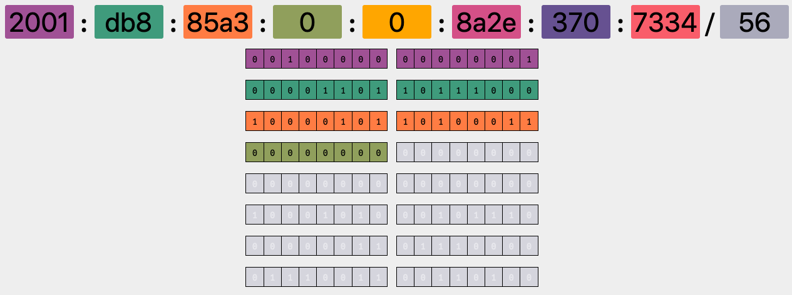

# cidrv6.xyz

**Web-based CIDR / netmask / IPv6 address visualizer - https://cidrv6.xyz**

[](https://cidrv6.xyz)

## Dev

Install dependencies and run the development server:

```bash
$ yarn
$ yarn run start
```

## Build

Manually building the static content into the `dist/` directory can be done with:

```bash
$ yarn run build
```

## Deployment

Deployment is automated from `master` branch to AWS S3 / CloudFront.

This repository is a fork of [yuvadm/cidr.xyz](https://github.com/yuvadm/cidr.xyz).